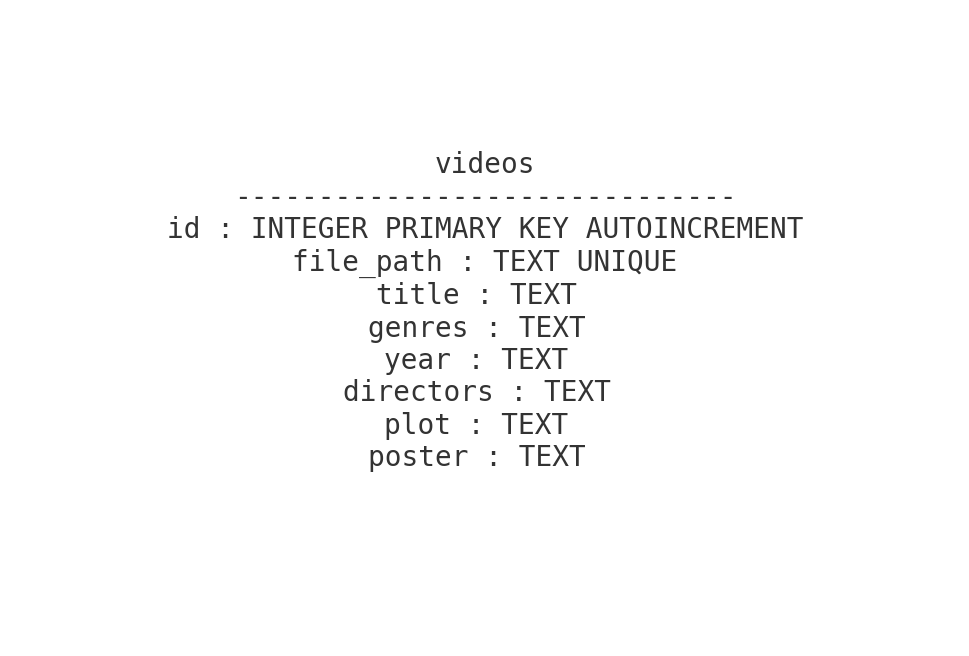

# 🎬 Playlist Manager

Playlist Manager è un'applicazione desktop in Python per la gestione e visualizzazione di playlist video, con integrazione dei metadati dai file `.nfo` stile Kodi e un'interfaccia per la gestione completa del database.

## 🚀 Funzionalità principali

- Caricamento automatico dei metadati dai file `.nfo`
- Visualizzazione di poster e dettagli video
- Filtri per genere, anno e regista
- Creazione e gestione di playlist
- Interfaccia per la gestione delle tabelle del database (eliminazione di più record in base a un campo selezionato)
- Supporto a vari formati video: '.mp4', '.mkv', '.avi', '.mov', '.wmv', '.flv'

## 🔧 Requisiti

- Python 3.8+ (andrà installato se non già fatto)
- Librerie indicate in `requirements.txt`

## Installazione

1. Clona o scarica questo repository
   ```bash
   git clone https://github.com/tuo-utente/Playlist-Manager.git
   cd Playlist-Manager
    ```
3. Installa i requisiti:
   ```bash
   pip install -r requirements.txt
   ```
4. Assicurati che il database SQLite (`videos.db`) sia nella stessa cartella del codice

## Utilizzo
### ▶️ Avvio dell'applicazione
Avvia l'app con:
```bash
python main_window.py
```
oppure

```bash
python3 main_window.py
```

### Pulsanti principali
- **Apri cartella**: scansiona una cartella alla ricerca di file video e `.nfo`
- **Gestione DB**: apre la finestra di gestione delle tabelle
- **Filtri**: filtra i video per genere, anno o regista

### 🗄 Gestione Database

- Apri la finestra Gestione DB dal pulsante dedicato nella GUI per:
   - Visualizzare tutte le tabelle e i record,
   - Eliminare più record in base a un campo selezionato
- Nessuna funzione di inserimento manuale (solo gestione ed eliminazione)

### Struttura del Database

Il progetto utilizza un database SQLite (playlist.db) per archiviare i metadati dei video.
Il database contiene una singola tabella principale:

Tabella videos

[](db_schema.png)

## Note

- I dati vengono estratti automaticamente da file .nfo quando presenti, o inseriti tramite scansione cartelle.
- Il campo file_path è univoco: se un video già esiste, le informazioni vengono aggiornate.
- I generi e i registi sono memorizzati come stringhe di testo, ma filtrabili nell’interfaccia grafica.

### Formato NFO supportato

Esempio minimo:
```xml
<movie>
    <title>Il mio film</title>
    <year>2023</year>
    <genre>Azione</genre>
    <genre>Avventura</genre>
    <director>Mario Rossi</director>
    <plot>Una trama avvincente.</plot>
    <thumb>poster.jpg</thumb>
</movie>
```

Il file .nfo deve avere lo stesso nome del video corrispondente.

## 📂 Struttura del progetto

```graphql
PlaylistManager/
│
├── main_window.py        # Finestra principale dell'applicazione
├──── db_manager            # Modulo interno per la gestione del database SQLite
├──── nfo_parser            # Parser interno dei file .nfo
├── requirements.txt      # i requisiti da installare
├── videos.db             # Database SQLite generato automaticamente
└── README.md             # Questo file
```


## 📊 Diagramma di flusso semplificato
   ```mermaid
   flowchart TD
       A[Avvio Applicazione] --> B[Caricamento Playlist]
       B --> C[Scansione cartelle video]
       C --> D{NFO trovato?}
       D -->|Sì| E[Parsing NFO e salvataggio nel DB]
       D -->|No| F[Usa solo nome file]
       E --> G[Visualizzazione GUI]
       F --> G
       G --> H[Filtri attivi?]
       H -->|Sì| I[Query filtrata su DB]
       H -->|No| J[Visualizza tutti]
       I --> K[Mostra poster + info]
       J --> K
   ```
### Contributi

Sono benvenuti contributi, segnalazioni di bug e nuove funzionalità!
Apri una **Issue** o invia una **Pull Request** su GitHub.

## 📜 Licenza

Questo progetto è distribuito sotto licenza [GPL-3.0](https://www.gnu.org/licenses/gpl-3.0.html).
